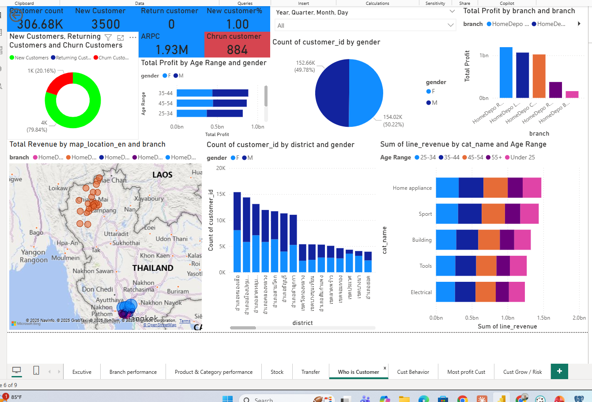
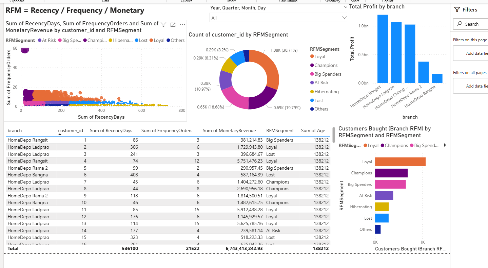
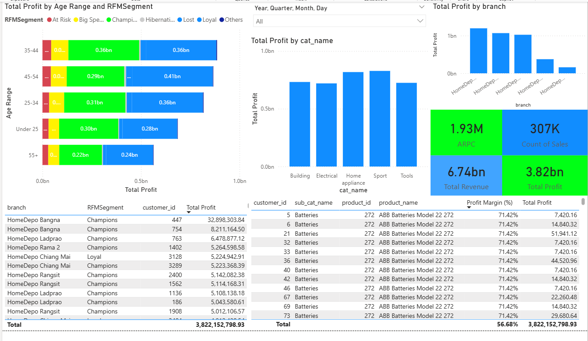

# Retail BI Dashboard – HomeDepo (Demo)

โปรเจกต์นี้เป็น **Power BI Portfolio (Demo)** ที่ออกแบบมาเพื่อสาธิตแนวคิดการทำ  
**Business Intelligence สำหรับธุรกิจค้าปลีก (Retail)** ตั้งแต่ระดับผู้บริหารจนถึงหน้างาน

เป้าหมายไม่ใช่แค่ “ทำกราฟสวย”  
แต่คือการแสดงให้เห็นว่า **ข้อมูลสามารถเล่าเรื่อง และช่วยตัดสินใจทางธุรกิจได้จริง**

---

## 🔁 ภาพรวมแนวคิด (Analytics Flow)

**Raw Data → Star Schema → Business Metrics → Dashboard → Decision**

ข้อมูลจากยอดขาย สินค้า ลูกค้า สาขา และสต๊อก  
ถูกออกแบบเป็นโครงสร้างแบบ Star Schema แล้วนำมาสร้างตัวชี้วัด (Metrics)  
เพื่อเล่าเรื่องตามมุมมองของผู้ใช้งานแต่ละระดับ

---

# 📄 Page 1: Executive Dashboard

### Concept
ภาพรวมสุขภาพธุรกิจ (Business Health Check) ในหน้าเดียว

### สิ่งที่ต้องการตอบ
- ธุรกิจกำไรหรือไม่?
- แนวโน้มรายได้และกำไรเป็นอย่างไร?
- สาขาใดเป็นตัวขับเคลื่อนหลักขององค์กร?

---

# 📄 Page 2: Branch Performance

### Concept
เปรียบเทียบประสิทธิภาพของแต่ละสาขา

### สิ่งที่ดู
- Revenue / Cost / Profit ต่อสาขา
- แนวโน้มรายวันและรายเดือน
- ปริมาณคำสั่งซื้อ

---

# 📄 Page 3: Product & Category Performance

### Concept
เข้าใจว่าสินค้าและหมวดใด “ทำเงินให้ธุรกิจจริง”

---

# 📄 Page 4: Stock & Inventory

### Concept
ควบคุมความเสี่ยงจากสต๊อก (Inventory Risk)

---

# 📄 Page 5: Who is Customer

### Concept
เข้าใจว่า “ลูกค้าของเราเป็นใคร”

---

# 📄 Page 6: Customer Behavior & RFM

### Concept
วิเคราะห์พฤติกรรมลูกค้าด้วย RFM

---

# 📄 Page 7: Most Profit Customer

### Concept
โฟกัส “ลูกค้าที่สร้างกำไรจริง”

---

# 📖 Business Storytelling

Dashboard นี้ช่วยให้ธุรกิจมองเห็นทั้ง **ภาพรวม**, **ความเสี่ยง**, และ **โอกาสในการเติบโต**  
โดยเชื่อมโยงข้อมูลจากหลายมุมมองเข้าด้วยกัน

> Data จะมีคุณค่า ก็ต่อเมื่อมันช่วยให้ธุรกิจตัดสินใจได้ดีขึ้น

---

## 👤 Author
Thana Pattanaverakit  
Data Analytics | Business Intelligence | Power BI | SQL
