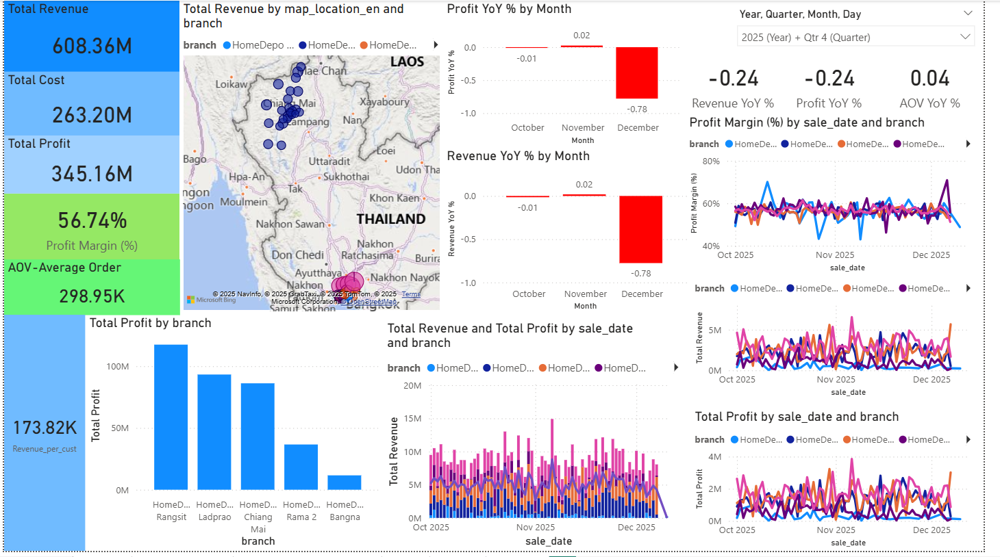
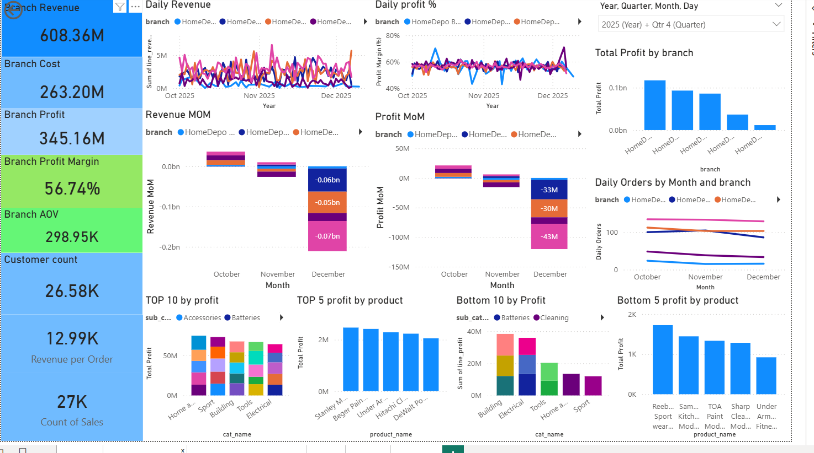
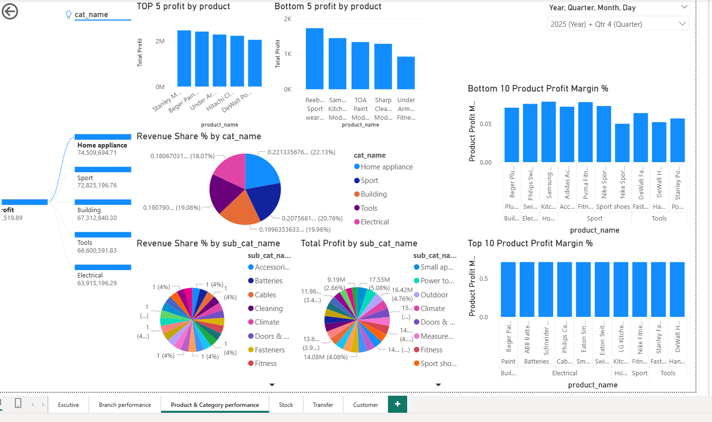
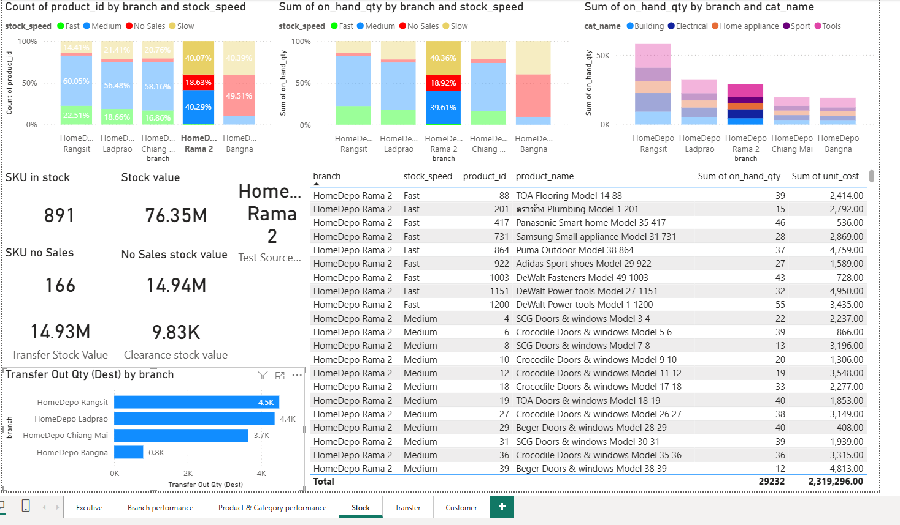
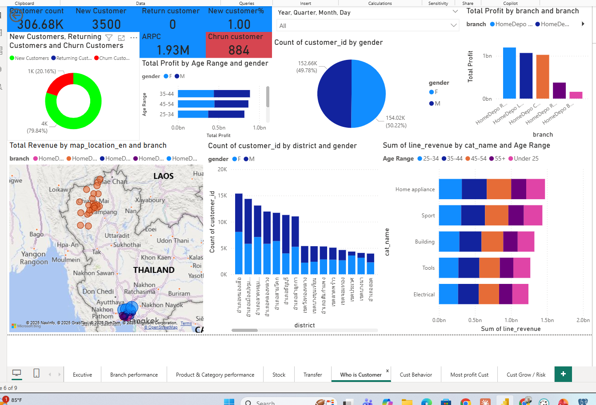
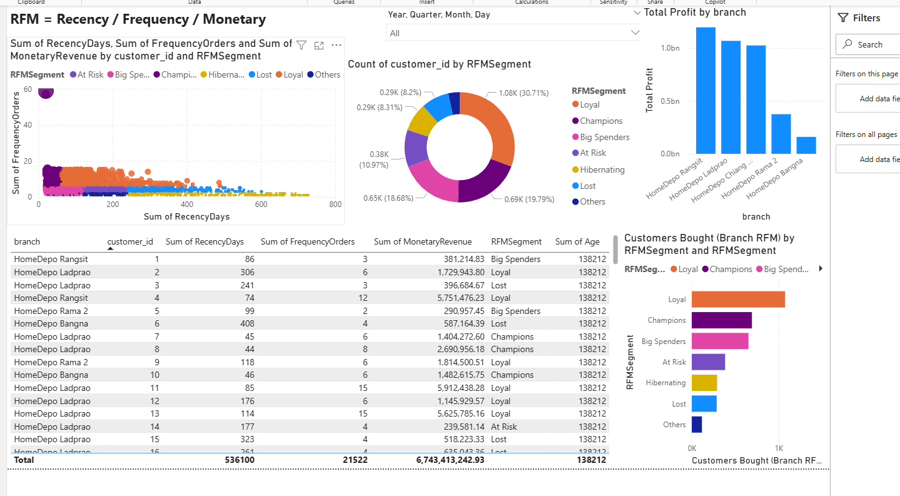
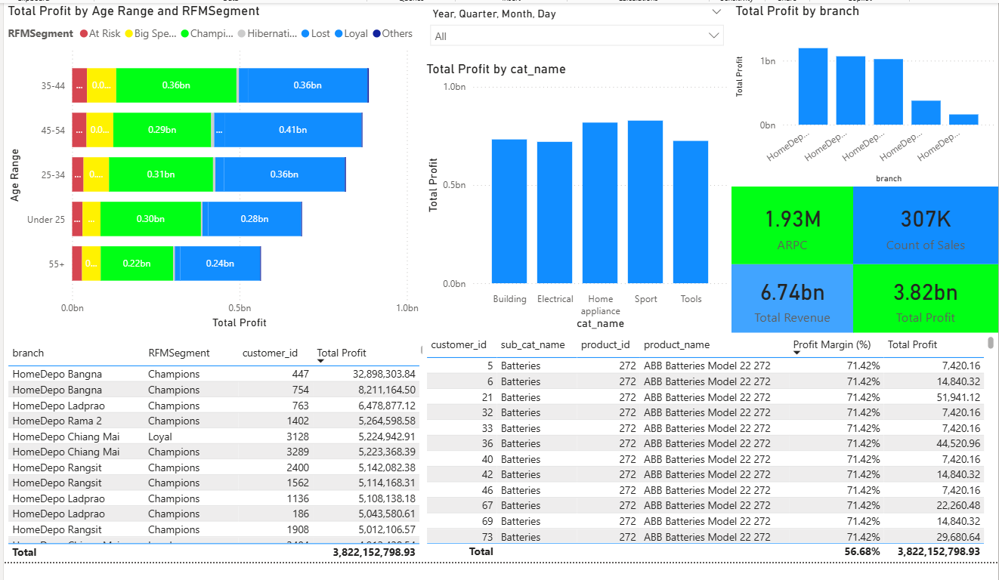

# Retail BI Dashboard – HomeDepo (Demo)

โปรเจกต์นี้เป็น **Power BI Portfolio (Demo)** ที่ออกแบบมาเพื่อสาธิตแนวคิดการทำ  
**Business Intelligence สำหรับธุรกิจค้าปลีก (Retail)** ตั้งแต่ระดับผู้บริหารจนถึงหน้างาน

เป้าหมายไม่ใช่แค่ “ทำกราฟสวย”  
แต่คือการแสดงให้เห็นว่า **ข้อมูลสามารถเล่าเรื่อง และช่วยตัดสินใจทางธุรกิจได้จริง**

---

## 🔁 ภาพรวมแนวคิด (Analytics Flow)

**Raw Data → Star Schema → Business Metrics → Dashboard → Decision**

ข้อมูลจากยอดขาย สินค้า ลูกค้า สาขา และสต๊อก  
ถูกออกแบบเป็นโครงสร้างแบบ Star Schema แล้วนำมาสร้างตัวชี้วัด (Metrics)  
เพื่อเล่าเรื่องตามมุมมองของผู้ใช้งานแต่ละระดับ

---

# 📄 Page 1: Executive Dashboard

### Concept
ภาพรวมสุขภาพธุรกิจ (Business Health Check) ในหน้าเดียว

### สิ่งที่ต้องการตอบ
- ธุรกิจกำไรหรือไม่?
- แนวโน้มรายได้และกำไรเป็นอย่างไร?
- สาขาใดเป็นตัวขับเคลื่อนหลักขององค์กร?

---

# 📄 Page 2: Branch Performance

### Concept
เปรียบเทียบประสิทธิภาพของแต่ละสาขา

### สิ่งที่ดู
- Revenue / Cost / Profit ต่อสาขา
- แนวโน้มรายวันและรายเดือน
- ปริมาณคำสั่งซื้อ

---

# 📄 Page 3: Product & Category Performance

### Concept
เข้าใจว่าสินค้าและหมวดใด “ทำเงินให้ธุรกิจจริง”

---

# 📄 Page 4: Stock & Inventory

### Concept
**ควบคุมความเสี่ยงจากสต๊อก (Inventory Risk)  
ด้วยการวัด **ความเร็วในการหมุนของสินค้า** และ **จำนวนวันที่สต๊อกยังรองรับยอดขายได้**
**---
### Key Metrics
- **Sales (Last 90 Days)**: จำนวนที่ขายได้ใน 90 วันล่าสุด  
- **Avg Daily Sales (90d)** = Sales 90d / 90  
- **On Hand Qty**: จำนวนคงเหลือปัจจุบัน  
- **Days of Cover (DoC)** = On Hand Qty / Avg Daily Sales (90d)
---
### Stock Speed Classification
- **No Sales**: Sales 90d = 0 (สินค้าค้าง / ไม่หมุน)  
- **Fast**: DoC ≤ 30 days  
- **Medium**: 31–90 days  
- **Slow**: 91–180 days  
- **Overstock**: DoC > 180 days (เงินจม / เสี่ยงเสื่อม / เสี่ยงตกรุ่น)
---
### Inventory Risk View
โฟกัสสินค้ากลุ่ม **No Sales** และ **Overstock** เพื่อใช้ตัดสินใจ:
- ลดราคา / ทำโปร  
- โยกย้ายข้ามสาขา (Transfer Suggestion)  
- ปรับลดการสั่งเข้า / Reorder Policy
---

# 📄 Page 5: Who is Customer(New & Churn)

### Concept
เข้าใจว่า “ลูกค้าของเราเป็นใคร”
จำแนกสถานะลูกค้าเพื่อเข้าใจการเติบโตและการสูญเสียของฐานลูกค้า  
โดยพิจารณาจากพฤติกรรมการซื้อในช่วงเวลาที่กำหนด

---
### Customer Definitions
- **New Customer**: ลูกค้าที่มี First Purchase ภายใน 90 วันล่าสุด  
- **Active Customer**: ลูกค้าที่มีการซื้อซ้ำภายใน 90 วัน  
- **At Risk Customer**: ลูกค้าที่ไม่ได้ซื้อมา 91–180 วัน  
- **Churn Customer**: ลูกค้าที่หยุดซื้อเกิน 180 วัน

---
### Business Use
- วิเคราะห์การเติบโตของฐานลูกค้า (New vs Returning)
- ตรวจจับสัญญาณลูกค้าที่กำลังจะหายไป (At Risk)
- ใช้กำหนดกลยุทธ์ Retention และ Reactivation
---

# 📄 Page 6: Customer Behavior & RFM

## 🧩 RFM Analysis (Customer Value Segmentation)

### Concept
RFM เป็นการวิเคราะห์คุณค่าของลูกค้าโดยใช้พฤติกรรมการซื้อจริง  
ประกอบด้วย Recency, Frequency และ Monetary  
เพื่อแยกลูกค้าตามระดับความสำคัญและความเสี่ยงในการหลุดออกจากระบบ

---
### RFM Metrics
- **Recency (R)**: จำนวนวันตั้งแต่การซื้อครั้งล่าสุด  
- **Frequency (F)**: จำนวนครั้งที่ซื้อในช่วงเวลาที่กำหนด  
- **Monetary (M)**: ยอดใช้จ่ายรวมของลูกค้า

---
### RFM Scoring
ลูกค้าแต่ละรายจะถูกจัดอันดับและให้คะแนนในแต่ละมิติ  
เช่น 1–5 (ค่าสูงหมายถึงคุณค่าสูง)

---
### RFM Segments
- **Champions**: ลูกค้าคุณค่าสูง ซื้อบ่อย และเพิ่งซื้อ
- **Loyal Customers**: ลูกค้าที่ซื้อซ้ำสม่ำเสมอ
- **Potential Loyalists**: ลูกค้าที่มีแนวโน้มพัฒนาเป็นลูกค้าหลัก
- **New Customers**: ลูกค้าใหม่ที่เพิ่งเริ่มซื้อ
- **At Risk**: ลูกค้าที่เริ่มห่างหาย
- **Churned**: ลูกค้าที่หยุดซื้อไปแล้ว
## 🔢 RFM Scoring 
### Option A: Quantile Scoring (Recommended)
ให้คะแนนโดยแบ่งลูกค้าออกเป็น 5 กลุ่มเท่า ๆ กัน (20% ต่อกลุ่ม) ตามแต่ละมิติ  
ข้อดี: คะแนนบาลานซ์, เหมาะกับข้อมูลจริงที่กระจายไม่เท่ากัน

#### Recency (R)
- คำนวณ `RecencyDays = Today - LastPurchaseDate`
- เรียงจากน้อยไปมาก (ยิ่งน้อยยิ่งดี)
- ให้คะแนน:
  - R=5: 20% ที่เพิ่งซื้อที่สุด
  - R=4: ถัดมา
  - ...
  - R=1: 20% ที่หายไปนานที่สุด

#### Frequency (F)
- คำนวณ `Frequency = #Transactions in last 365 days` (หรือ 180/90 ตามธุรกิจ)
- เรียงจากมากไปน้อย (ยิ่งมากยิ่งดี)
- ให้คะแนน:
  - F=5: 20% ที่ซื้อบ่อยที่สุด
  - ...
  - F=1: 20% ที่ซื้อน้อยที่สุด

#### Monetary (M)
- คำนวณ `Monetary = TotalSpend in last 365 days` (หรือช่วงเวลาเดียวกับ F)
- เรียงจากมากไปน้อย (ยิ่งมากยิ่งดี)
- ให้คะแนน:
  - M=5: 20% ที่ใช้จ่ายสูงที่สุด
  - ...
  - M=1: 20% ที่ใช้จ่ายต่ำที่สุด

> Output ตัวอย่าง: `RFM = 5-4-2` หรือ `542`  
> ใช้ทำ Segment เช่น Champions, Loyal, At Risk, Churned

---
### Option B: Threshold Scoring (Business Rule Based)
ให้คะแนนด้วยเกณฑ์วัน/จำนวนครั้ง/ยอดเงินที่กำหนดเอง  
ข้อดี: ควบคุมความหมายทางธุรกิจได้ชัด (แต่ต้อง tune ให้เหมาะกับข้อมูล)

#### Recency (R) example
- R=5: ≤ 30 days  
- R=4: 31–60 days  
- R=3: 61–90 days  
- R=2: 91–180 days  
- R=1: > 180 days

#### Frequency (F) example (last 365d)
- F=5: ≥ 12 purchases  
- F=4: 8–11  
- F=3: 4–7  
- F=2: 2–3  
- F=1: 0–1

#### Monetary (M) example (last 365d)
- M=5: ≥ P80 (top 20%) spend  
- M=4: P60–P80  
- M=3: P40–P60  
- M=2: P20–P40  
- M=1: < P20

---

# 📄 Page 7: Most Profit Customer

### Concept
โฟกัส “ลูกค้าที่สร้างกำไรจริง”
## 🏷️ RFM Segmentation (GitHub Version)

### Concept
แปลงคะแนน RFM (Recency, Frequency, Monetary)  
ให้เป็นกลุ่มลูกค้าที่มีความหมายทางธุรกิจ  
เพื่อใช้กำหนดกลยุทธ์ Retention, Reactivation และ Growth

---
### RFM Score Format
- แต่ละมิติให้คะแนน 1–5
- รวมเป็นรูปแบบ `R-F-M` (เช่น 5-5-5, 4-5-4)

---
### RFM Segments Definition

#### 🏆 Champions
- **R ≥ 4 AND F ≥ 4 AND M ≥ 4**
- ลูกค้าคุณค่าสูง ซื้อบ่อย ใช้เงินสูง และเพิ่งซื้อ
- กลยุทธ์: VIP, Early Access, Loyalty Reward

---
#### 💎 Loyal Customers
- **F ≥ 4 AND M ≥ 3 AND R ≥ 3**
- ลูกค้าซื้อซ้ำสม่ำเสมอ แต่ไม่จำเป็นต้องเพิ่งซื้อล่าสุด
- กลยุทธ์: Subscription, Bundle, Cross-sell

---
#### 🌱 Potential Loyalists
- **R ≥ 4 AND F = 2–3**
- ลูกค้าที่เพิ่งซื้อ และมี

---

# 📖 Business Storytelling
Dashboard นี้ช่วยให้ธุรกิจมองเห็นทั้ง **ภาพรวม**, **ความเสี่ยง**, และ **โอกาสในการเติบโต**  
โดยเชื่อมโยงข้อมูลจากหลายมุมมองเข้าด้วยกัน

> Data จะมีคุณค่า ก็ต่อเมื่อมันช่วยให้ธุรกิจตัดสินใจได้ดีขึ้น

---

## 👤 Author
Thana Pattanaverakit  
Data Analytics | Business Intelligence | Power BI | SQL
